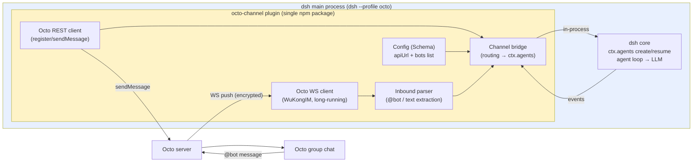
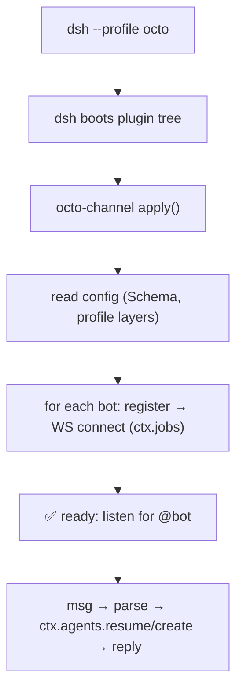
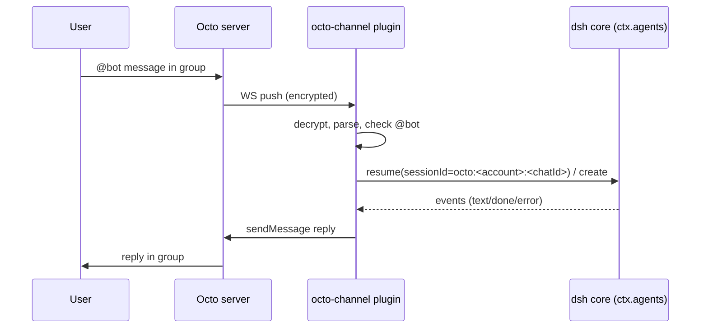

# PRD-C4-Plugin Architecture Rebuild (drop daemon, pure dsh plugin)

## Meta

| Field | Value |
|---|---|
| Stage | C4 |
| Name | Plugin architecture rebuild — drop daemon, pure dsh plugin |
| Status | In kickoff (draft) |
| Created | 2026-08-14 |
| Related | docs/TODO.yaml stage C4; PRD-C1 (AgentAdapter/server resume); PRD-C2 (Octo channel MVP); PRD-C3 (bot config); docs/deepseek-ecosystem.md (dsh plugin tree, ctx.jobs/ctx.agents) |

## 1. Background & Goal

- **Background**: C1–C3 built an **out-of-process daemon** (independent process + official
  SDK client JSON-RPC) mirroring the community `dsh-lark-bot` reference. The user now
  decides to **drop the daemon and go pure-plugin**: ship **one npm package** that is a
  first-class dsh plugin (Cordis bundle) living inside the dsh process — like
  `openclaw-channel-octo` is a plugin inside OpenClaw.
- **Goal**: `octo-channel` plugin — a single dsh plugin that, once assembled into a
  profile, connects to Octo (WS long-running), drives agents **in-process** via
  `ctx.agents` (no SDK client, no JSON-RPC), and replies via Octo REST. Config lives in
  the **dsh config system** (Schema + profile patch). Multi-bot via a `bots` list.
- **Rationale** (user decision + engineering):
  1. One package, installable with `dsh plugin add` — ecosystem-standard onboarding.
  2. No daemon process, no SDK/JSON-RPC layer — fewer moving parts.
  3. Config in dsh's own config system (user asked "can config live in dsh?").
  4. Session resume is native: `ctx.agents.resume` in-process (C1 already proved the
     dual-branch create/resume works inside a dsh plugin).
- **Non-goals**: streaming cards / approval cards (kept for later stages); CLI `send`
  command is retained as a dev tool (it exercises the same agent path) unless it becomes
  redundant.

## 2. Requirements

### 2.1 Functional requirements

- **FR1 Plugin skeleton**: Cordis bundle — `name: octo-channel`, `apply` wiring, config
  via `Schema.object` (dsh config system: profile patch / settings layers).
- **FR2 Octo access layer migrated**: `src/bridge/octo/` (protocol codec, WS client,
  REST client, inbound parsing) moves into the plugin unchanged in behavior.
- **FR3 In-process agent driving**: on inbound message → `ctx.agents.resume` (session
  exists / disk archive) or `ctx.agents.create`; agent events (text/reasoning/done/error)
  consumed in-process → aggregate → reply. **No SDK client, no JSON-RPC.**
- **FR4 Config in dsh system**: `octo` config section (apiUrl + bots list) defined by
  Schema; values from profile config layers. Legacy env-var fallback
  (`OCTO_API_URL/OCTO_BOT_TOKEN/OCTO_BOT_UID`) kept for convenience.
- **FR5 Multi-bot**: `bots` list in config; each bot gets its own WS connection +
  register; session key `octo:<accountId>:<chatId>` isolates groups per account.
- **FR6 Retirement**: remove daemon-era code — `src/adapters/dsh/sdk-adapter.ts`,
  `src/agent/dsh-client.ts`, `src/agent/sdk-profile.ts`, `src/bridge/run-octo.ts`,
  CLI `octo run`, self-built `octo-sdk-server` plugin, `withSdkProfileArgs`, tsup
  `octo-sdk-server` entry. Delete completely (no fallback branches).
- **FR7 Hello plugin**: keep the A2 hello bundle? (decide during review; likely keep as
  sample only, or remove if it clutters).

### 2.2 Non-functional

- One npm package; `dsh.bundle` declaration so `dsh plugin add`/profile assembly works.
- Docs (README) rewritten for plugin installation: create profile → `dsh plugin add
  octo-channel` (or profile bundle) → configure → `dsh --profile <name>`.

## 3. Architecture

### 3.1 Target architecture



### 3.2 Startup flow



### 3.3 Message flow



### 3.4 Code structure after rebuild

```
src/                       (octo-channel plugin — one package)
├── index.ts               plugin entry (apply: config + assembly + lifecycle)
├── channel.ts             bridge core (inbound → ctx.agents → reply)
├── agent.ts               ctx.agents wrapper (create/resume + event mapping)
├── config.ts              Schema.object (apiUrl + bots list)
├── octo/                  (migrated from src/bridge/octo/, behavior unchanged)
│   ├── protocol.ts        WuKongIM codec
│   ├── ws.ts              WS client (handshake/heartbeat/reconnect)
│   ├── api.ts             REST client (registerBot/sendMessage)
│   └── messages.ts        inbound parsing
└── octo/**.test.ts        migrated tests

Retired (delete entirely):
  src/adapters/dsh/sdk-adapter.ts / server/*      (SDK client + custom server)
  src/agent/dsh-client.ts / sdk-profile.ts        (SDK client + profile generation)
  src/bridge/run-octo.ts / octo-channel.ts        (daemon assembly)
  cli octo run                                     (daemon command)
  tsup entry octo-sdk-server                       (no longer built)
```

## 4. Interface definition

Config (dsh Schema → profile patch / settings):

```yaml
# profile config layer (e.g. cordis.patch.yml)
octo:
  apiUrl: https://im.deepminer.com.cn/api
  # wsUrl: wss://...                    # optional, server-authoritative default
  bots:
    - name: testbot                     # optional, log only
      botUid: xxxxxxxxx_bot
      botToken: bf_xxx
      # accountId: acct-1               # optional, default botUid
      # allowedGroups: [g1]             # optional whitelist
```

Env fallback (no octo section): `OCTO_API_URL/OCTO_BOT_TOKEN/OCTO_BOT_UID`.

## 5. Acceptance criteria

- [ ] AC1: `pnpm typecheck` + `pnpm lint` + `pnpm test` + `pnpm build` green.
- [ ] AC2: unit tests — config Schema (defaults/validation), migrated octo layer
  (protocol/ws/api/messages) still green, agent wrapper (fake ctx.agents: create/resume
  call shape, event mapping).
- [ ] AC3: spike verified — in-process `ctx.agents` full run (create + resume) AND WS
  long connection coexist in one dsh process (heartbeat stays alive while agent runs).
- [ ] AC4: live — plugin assembled into a profile; real Octo bot: @bot → dsh reply;
  group memory across restarts (in-process resume); multi-bot config (2 bots) connects.
- [ ] AC5: daemon-era code fully removed (grep: no sdk-adapter/dsh-client/sdk-profile/
  run-octo/octo run references).

## 6. Test plan

- Spike first (milestone M1 below) with a minimal plugin: ctx.agents round-trip +
  WS heartbeat coexistence — evidence before full rebuild.
- Unit: migrated octo layer tests unchanged; new config/agent/channel tests.
- Live checklist: profile assembly → real Octo bot → @bot → memory → multi-bot.

## 7. Milestones

| Milestone | Deliverable | Est. |
|---|---|---|
| M1 Spike | minimal plugin: ctx.agents create/resume + WS coexistence evidence | 0.5–1 d |
| M2 Core | plugin skeleton + config Schema + octo layer migration | 1 d |
| M3 Bridge | channel.ts (inbound → ctx.agents → reply) + multi-bot | 1 d |
| M4 Retirement | delete daemon-era code + CLI adjustments + docs rewrite | 0.5 d |
| M5 Verify | AC2/AC3/AC4/AC5 + live Octo bot | 1 d |

## 8. Risks & mitigations

| Risk | Mitigation |
|---|---|
| `ctx.agents` in-process API unstable (dsh developer preview) | M1 spike proves it; pin dsh version; compat shim (single source of truth) |
| WS long connection + agent loop block each other | M1 spike measures heartbeat during agent run; async IO should coexist |
| Config Schema vs profile patch merge semantics | spike + dump-config verification |
| Big rewrite churn | octo/ layer migrated unchanged; agent driving isolated in agent.ts; retirement is deletion (no dual-path) |

## 9. Change log

> **Mandatory audit trail**: any change to FR/AC/tech design MUST append a row
> (date + change + rationale) and re-verify affected ACs.

| Date | Change | Rationale |
|---|---|---|
| 2026-08-14 | Initial draft | User decision: "drop daemon, pluginize" — one package, ecosystem-standard install, config in dsh system, in-process resume |
